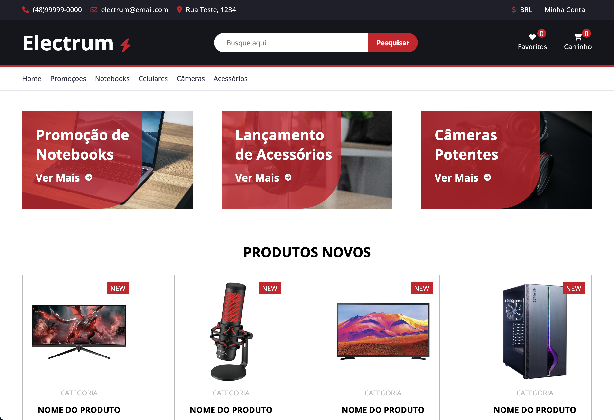

<p align="center">
  <a href="https://github.com/lgsfarias/electrum">
    
  </a>

  <h3 align="center">
    Electrum E-commerce
  </h3>
  <p align="center">
    A simple e-commerce built HTML and SASS
    <br />
    <a href="https://github.com/lgsfarias/go-gin-rest-api"><strong>Explore the docs »</strong></a>
    <br />
</p>


<br/><br/>

## 🎯 Goals

This project was built during a SASS course on the [Udemy](https://www.udemy.com/) platform. The course was taught by [Matheus Battisti](https://www.linkedin.com/in/matheusbattisti/) and the objective of the course was:

- [x] Learn the basics of SASS
- [x] Learn how to use SASS variables
- [x] Learn how to use SASS mixins
- [x] Learn how to use SASS functions
- [x] Learn how to use SASS extends
- [x] Learn how to use SASS media queries
- [x] Learn how to use SASS nesting

<br/>

## ⛏️ Built With

- [HTML](https://img.shields.io/badge/-HTML-E34F26?style=flat-square&logo=html5&logoColor=white)
- [SASS](https://img.shields.io/badge/-SASS-CC6699?style=flat-square&logo=sass&logoColor=white)

<br/>

## 🏁 Getting Started

To get a local copy up and running follow these simple steps

<br/>

## 🧰 Installation

Clone the repository

```sh
git clone https://github.com/lgsfarias/electrum.git
```

Acssess the project folder

```sh
cd electrum
```

<br/>

## 🏃🏽 Running the project

Open the `index.html` file in your browser

<br/>

## Contact

<div>
  <a href="https://www.linkedin.com/in/lgsfarias" target="_blank"></a>
  <a href = "mailto:lgsfarias.dev@gmail.com"></a>
</div>
